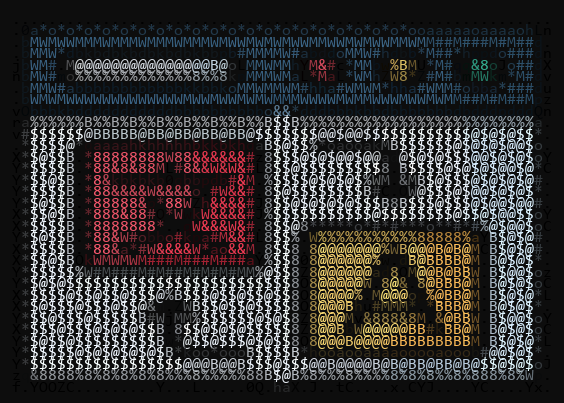

# img2ascii

Convert an image (PNG, ICO, JPG, etc.) into ASCII art for the terminal — plain text or ANSI 24-bit color, with optional dithering for smoother gradients.

## Example

```
$ python img2ascii.py ot-dark.png --width 60 --charset simple --bias 1.5
@+::::::::::::::::::::::::::::::::::::::::::::::::::::::::+@
:  ..........................................              :
  ::::::::::::::::::::::::::::::::::::::::::::............  
  :::.                   .::::::.   .:::.    .:...    ....  
  ::. :################*. .::::  :-. .::  =*: .:.  --. ...  
  ::. .=================  :::::. .:  .::  :-. .:.  ::  ...  
  :::..                 .:::::::.  ..::::.  ..:::..   ....  
  :::::::::::::::::::::::::::::::::::::::::::::::.........  
                            .--.                            
 .++++++++++++++++++++++++++*@@*++++++++++++++++++========. 
 .@@@@@@#*****************#%@%@@@@######%@@@@@@@@@%%%%%%%%. 
 .@@%@%.                   .*@%%@+...... :*@%%%%%%%%%%%%%%. 
 .@@%@* .=-------:--------. =@%%%%%%%%%%*. #@%%%%%%%%%%%%%. 
 .@@%@* .=------: .--:::--. =@%%%%@@@@@@@- +@@%%%%%%%%%%%%. 
 .@@%@* .=:             .-. =@%%%%%%%%@=:: -:*@%%%%%%%%%%%. 
 .@@%@* .=-----:----. .::-. =@%%%%%%%%@*.   :#@%%%%%%%%%%%. 
 .@@%@* .=---=- .==:  ----. =@%%%%@@@@%@@+=*@@%@@@%%%%%%%%. 
 .@@%@* .=-----. .:  :----. =@%@@@@@@@@@@@@@@@@@@@%%%%%%%%. 
 .@@%@* .=---==-.   :-----. =@@%-...................=%%%%%. 
 .@@%@* .=--:..  ..  ..:--. =@@= :+======+++=======. *%%%%. 
 .@@%@* .==-...:----:...--. =@@= =#######=:+##*****: +%%%%. 
 .@@%@*  ::::::............ =@@= =######+   *#*****: +%%%%. 
 .@@%%@+:.................:=%@@= =######. - .#*****: +%%%%. 
 .@@%%%@@@@@@@@@@@@@@@@@@@@@@%@= =#####: =%: -#****: +%%%%. 
 .@@%%%%%%%%%%@@#=*@@%%%%%%%%%@= =####= :###. +****: +%%%%. 
 .@@%%%%%%%%%@%-   :#@%%%%%%%%@= =###*  .:::. .****: +%%%%. 
 .@@%%%%%%%%%@*.: ::=@%%%%%%%%@= =###: ------: :***: +%%%%. 
 .@@%%%%%%%%%%@@+ -@@@@@@@%%%%@= =##+ :#####**. ***: +%%%%. 
 .@@%%%%%%%%%%%@* .#%%%%%%@%%%@= -###*####*****+***: +%%%%. 
 .@@%%%%%%%%%%%%@+. ......+@%%@#. ................. .#%%%%. 
 .@@@@@@@@@@@@@@@@@%######%@@%%@@#########*********#%%%%%%. 
: :=========================+@@+=========================: :
@+::::::::::::::::::::::::::=@@=::::::::::::::::::::::::::+@
```

(This uses `--charset simple` with `--bias 1.5` for a lighter, airier look. The default `--charset detailed` with `--bias 1.0` gives a much finer, denser result.)

Run with `--color` in a terminal that supports 24-bit ANSI color for a full-color version. This example also uses `--dither floyd-steinberg`, a black `--bg`, and a low `--bias` for a denser, punchier look:

```
python img2ascii.py ot-dark.png --width 60 --charset detailed --dither floyd-steinberg --color --bg 0,0,0 --bias 0.1
```



## Requirements

- Python 3
- [Pillow](https://python-pillow.org/) (`pip install pillow`)

## Usage

```
python img2ascii.py <image_path> [options]
```

### Options

| Option | Description |
|---|---|
| `--width N` | Output width in characters (default: `80`) |
| `--color` | Output ANSI 24-bit color codes (colored ASCII, great for modern terminals) |
| `--invert` | Invert brightness mapping (use for dark-background terminals if it looks wrong) |
| `--charset NAME` | `simple` (`@%#*+=-:. `), `detailed` (default; wider ramp of characters), or `blocks` (`░▒▓█`) |
| `--dither NAME` | `none` (default), `floyd-steinberg`, `atkinson`, or `ordered` — smooths gradients into a shaded texture instead of flat bands of one character, most noticeable on soft shadows/highlights and smooth backgrounds |
| `--bg R,G,B` | Background color to composite transparent areas onto (default: `255,255,255`) |
| `--bias FLOAT` | Density bias (gamma) applied to the brightness→character mapping (default: `1.0`, linear). `<1` biases toward denser/darker characters (more ink); `>1` biases toward lighter/sparser ones |
| `--out FILE` | Also save the rendered output (color ANSI codes or plain text) to a file |

### Examples

```
# Plain ASCII, default width
python img2ascii.py photo.jpg

# Wider, colored output using the block charset
python img2ascii.py photo.jpg --width 120 --color --charset blocks

# Smoother gradients via dithering, saved to a file
python img2ascii.py photo.jpg --dither floyd-steinberg --out photo_ascii.txt

# Composite transparent PNG areas onto black instead of white
python img2ascii.py icon.png --bg 0,0,0 --invert
```

A file saved with `--out` while `--color` is set contains raw ANSI escape codes; it will render correctly when printed to a compatible terminal, e.g. `cat photo_ascii.txt`.

## Credits

`ot-dark.png` is a sample icon designed by [Magnific](https://www.magnific.com) — see `icon attribution.txt`.

## License

MIT — see [LICENSE](LICENSE).
